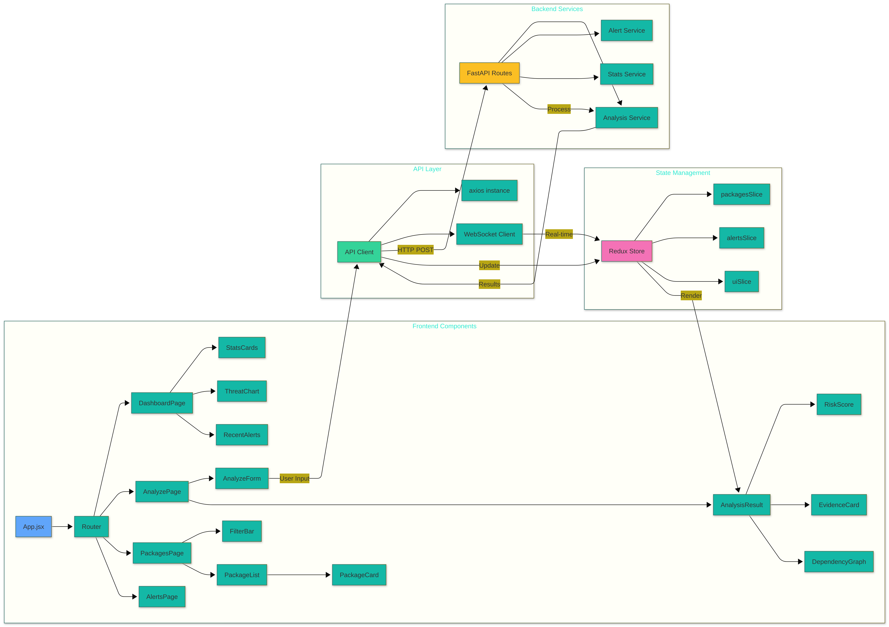
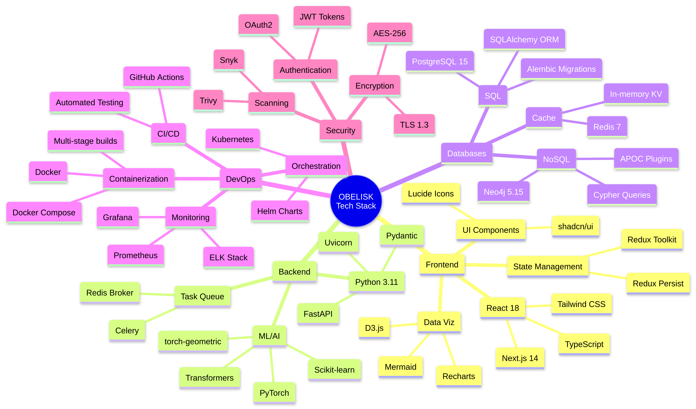
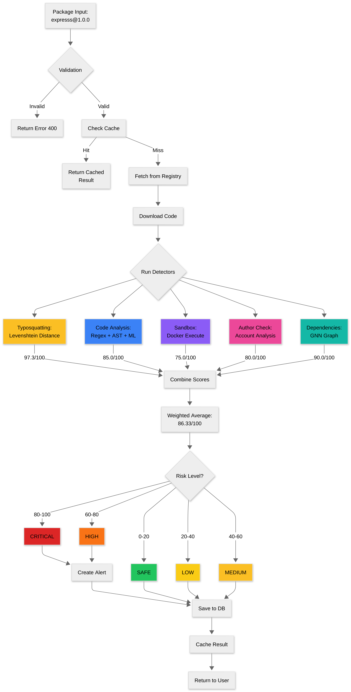
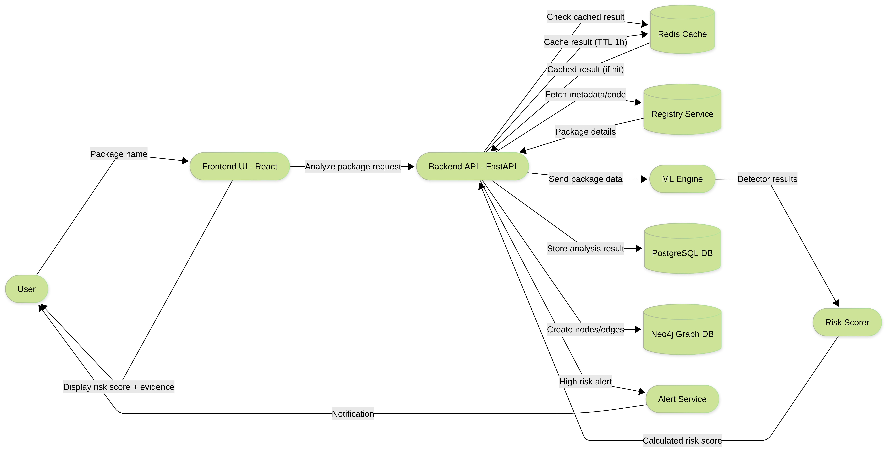
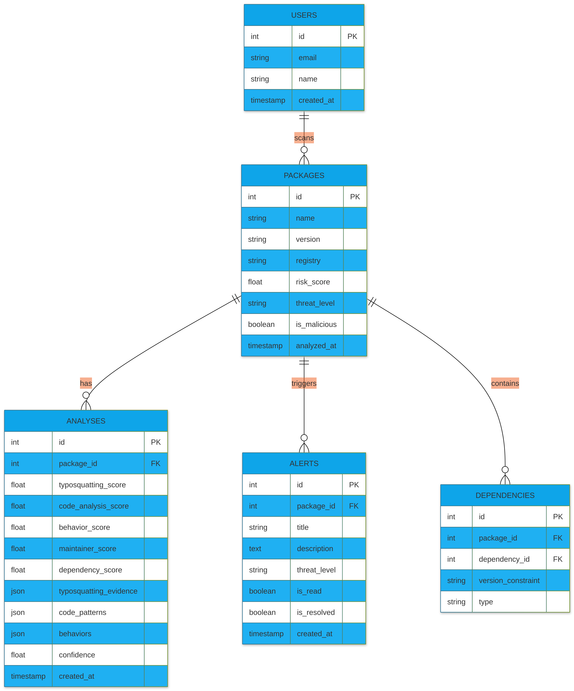
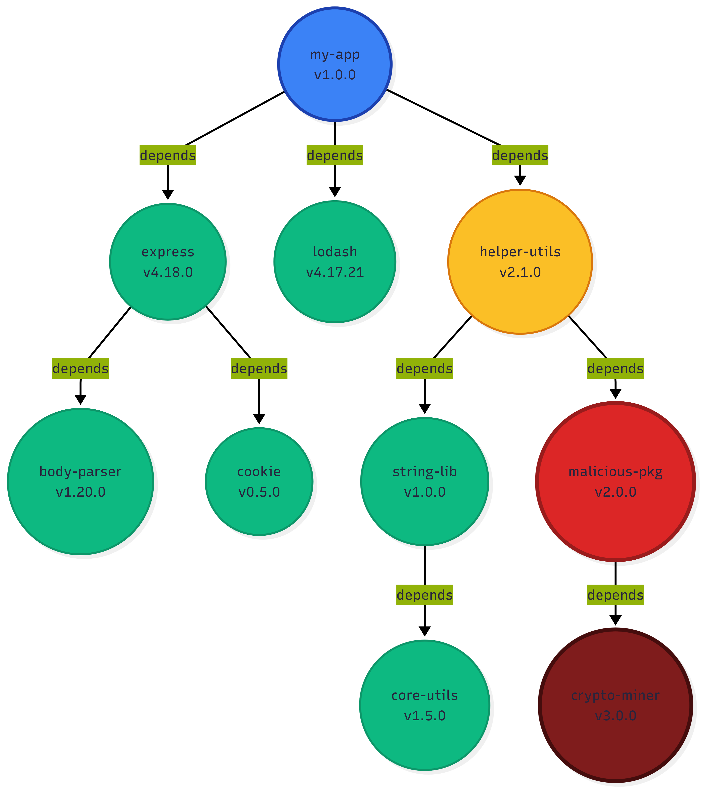
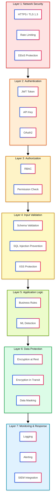
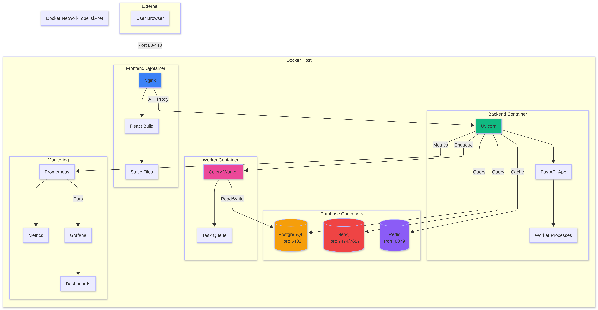
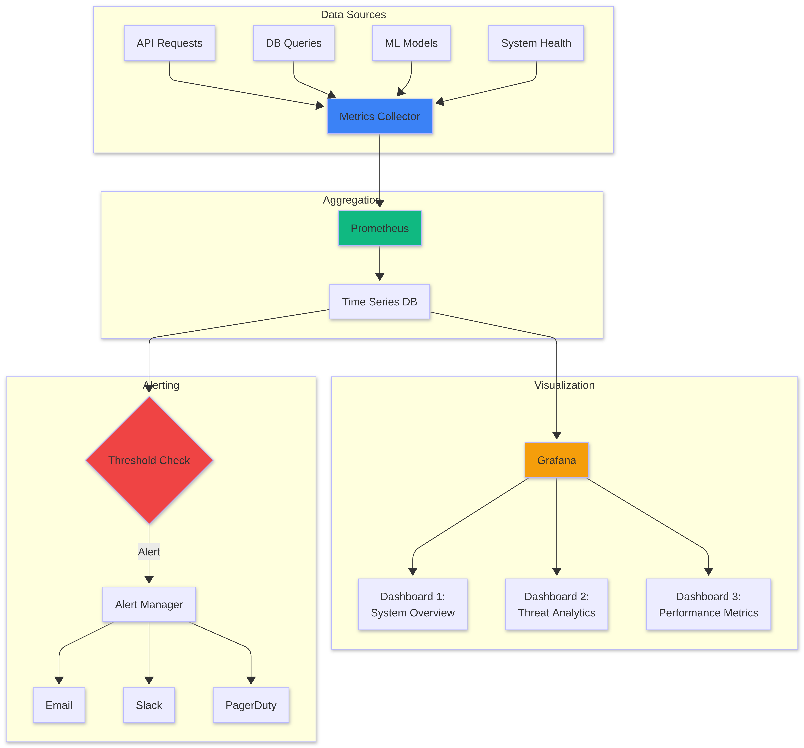

<div align="center">

# 🏛️ OBELISK

### **O**mniscient **B**ehavioral **E**ntity **L**everaging **I**ntelligent **S**urveillance for **K**ill-chain Prevention

An AI-powered software supply chain attack detection platform that combines deep learning, graph analysis, and behavioral heuristics to identify malicious packages in real time.

[](LICENSE)
[](https://python.org)
[](https://fastapi.tiangolo.com)
[](https://react.dev)
[](https://docs.docker.com/compose/)

</div>

---

## Table of Contents

- [Overview](#overview)
- [Key Features](#key-features)
- [System Architecture](#system-architecture)
- [Tech Stack](#tech-stack)
- [ML Detection Pipeline](#ml-detection-pipeline)
- [Data Flow](#data-flow)
- [Database Schema](#database-schema)
- [Security Architecture](#security-architecture)
- [Getting Started](#getting-started)
  - [Prerequisites](#prerequisites)
  - [Quick Start (Docker)](#quick-start-docker)
  - [Manual Setup](#manual-setup)
- [Usage](#usage)
- [API Reference](#api-reference)
- [Project Structure](#project-structure)
- [Deployment](#deployment)
- [Monitoring & Observability](#monitoring--observability)
- [Configuration](#configuration)
- [Testing](#testing)
- [Contributing](#contributing)
- [License](#license)

---

## Overview

Software supply chain attacks — such as typosquatting, dependency confusion, and malicious code injection — are among the fastest-growing threats in modern software development. **OBELISK** is a production-grade security platform that proactively detects these threats by analyzing packages from npm and PyPI registries using a multi-layered AI pipeline.

OBELISK monitors package registries in real time, runs five independent ML/heuristic detectors in parallel, builds dependency graphs in a graph database, and surfaces results through an interactive dashboard — enabling security teams to catch compromised packages before they reach production.

---

## Key Features

| Category | Feature |
|----------|---------|
| **Detection** | Five parallel ML detectors: typosquatting, code analysis (CodeBERT), behavioral analysis, maintainer anomaly detection, and GNN-based dependency graph analysis |
| **Risk Scoring** | Weighted ensemble scoring (0–100) with configurable thresholds and confidence metrics |
| **Real-Time Monitoring** | WebSocket-powered live feed of registry crawls and newly flagged packages |
| **Dependency Graphs** | Neo4j-backed graph traversal to identify transitive supply chain risks up to 5 levels deep |
| **Sandboxed Execution** | Docker-based sandbox for safe dynamic analysis of package install scripts |
| **Interactive Dashboard** | React + Tailwind UI with charts, threat distribution views, and package detail pages |
| **Alerting** | Automatic alert generation for high/critical threats with notification support |
| **Caching** | Redis-backed result caching (TTL 3600s) for fast repeat lookups |
| **API Security** | SHA-256 hashed API keys, rate limiting (sliding window), and open-redirect protection |
| **Infrastructure** | Full Docker Compose, Kubernetes manifests, Terraform modules, and Prometheus/Grafana monitoring |

---

## System Architecture

OBELISK follows a layered microservices architecture. Users interact through a React dashboard, which communicates over REST/WebSocket with a FastAPI backend. The backend orchestrates ML detection, persists results across three databases, and dispatches background work via Celery.

<div align="center">

<br /><em>High-level system architecture — API gateway, analysis engine, databases, and external integrations</em>
</div>

<br />

<details>
<summary><strong>🔍 Component Interaction Detail</strong></summary>
<br />
<div align="center">

<br /><em>Detailed component interaction — service boundaries, data persistence, and notification flows</em>
</div>
</details>

The **Analysis Service** orchestrates the full pipeline: check cache → fetch registry metadata → run all 5 detectors concurrently via `asyncio.gather` → compute weighted risk score → persist results to PostgreSQL & Neo4j → cache in Redis → fire alerts if critical.

---

## Tech Stack

<div align="center">

<br /><em>Full technology map — backend, frontend, ML/AI, databases, DevOps, and security</em>
</div>

<br />

| Layer | Technologies |
|-------|-------------|
| **Frontend** | React 18, Redux Toolkit, React Router v6, Tailwind CSS, Recharts, D3.js, Lucide Icons |
| **Backend** | Python 3.10+, FastAPI, Pydantic v2, SQLAlchemy 2.0, Alembic, Celery |
| **ML / AI** | PyTorch, Transformers (CodeBERT), scikit-learn (Isolation Forest), PyTorch Geometric (GNN), Tree-sitter |
| **Databases** | PostgreSQL 15, Neo4j 5.15, Redis 7 |
| **Infrastructure** | Docker & Docker Compose, Kubernetes, Terraform, Nginx |
| **Monitoring** | Prometheus, Grafana (dashboards + alert rules) |
| **CI/CD** | GitHub Actions (backend tests, frontend tests, deployment) |
| **Code Quality** | Black, Flake8, Mypy, ESLint, Prettier |

---

## ML Detection Pipeline

OBELISK employs five specialized detectors that run **in parallel** and feed into a weighted risk scorer:

<div align="center">

<br /><em>Input validation → feature engineering → parallel detection models → weighted aggregation → threat classification</em>
</div>

<br />

### 1. Typosquatting Detector — *weight: 0.25*
Compares package names against a curated list of popular packages using **Levenshtein distance** and **similarity ratios**. Flags packages with edit distance ≤ 2 or similarity ≥ 0.85 to known legitimate packages.

### 2. Code Analyzer (CodeBERT) — *weight: 0.35*
Two-pronged analysis:
- **Pattern scanning:** 23+ compiled regex patterns detecting `eval()`, `exec()`, `subprocess`, `os.system`, `child_process`, `curl | sh`, base64 encoding, dynamic imports, and more — each weighted by risk severity (5–25).
- **CodeBERT inference:** When the fine-tuned model is loaded, blends the pattern score (40%) with the CodeBERT malicious probability (60%) for a hybrid result.

### 3. Behavior Analyzer — *weight: 0.15*
Scores suspicious lifecycle and runtime behaviors: `preinstall`/`postinstall` hooks, pipe-to-shell commands, obfuscated entry points, missing repository links, excessive dependencies, base64/Buffer manipulation, and environment variable access.

### 4. Anomaly Detector — *weight: 0.15*
Profiles maintainer risk signals: new accounts (< 30 days), disposable email providers, first-time publishers, unverified emails, missing GitHub presence, and zero download history. Optionally enhanced with an **Isolation Forest** ML model.

### 5. GNN Dependency Analyzer — *weight: 0.10*
Traverses the dependency graph in **Neo4j** up to 5 levels deep, identifying known malicious dependencies, high-risk transitive nodes, and suspicious graph topology. Optionally enhanced with a **Graph Neural Network** model.

### Risk Scoring
The **RiskScorer** aggregates all detector outputs into a final weighted score (0–100), computes a **confidence metric** based on inter-detector agreement (threshold: 50), and classifies the threat level. Packages scoring ≥ 60 are flagged as **malicious**.

<details>
<summary><strong>📊 End-to-End Threat Detection Flow</strong></summary>
<br />
<div align="center">

<br /><em>Complete analysis flowchart — from package input through cache check, registry fetch, parallel detection, score aggregation, to risk classification and persistence</em>
</div>
</details>

---

## Data Flow

<div align="center">

<br /><em>End-to-end data flow — from user request through the React frontend, FastAPI backend, ML engine, databases, and alert dispatch</em>
</div>

---

## Database Schema

OBELISK uses a multi-database architecture: **PostgreSQL** for relational storage, **Neo4j** for dependency graphs, and **Redis** for caching.

<div align="center">

<br /><em>PostgreSQL entity-relationship diagram — Users, Packages, Analyses, Alerts, and Dependencies</em>
</div>

<br />

<details>
<summary><strong>🌐 Neo4j Dependency Graph Example</strong></summary>
<br />
<div align="center">

<br /><em>Graph visualization showing how OBELISK traces transitive dependencies to detect malicious packages hidden deep in the supply chain</em>
</div>
</details>

---

## Security Architecture

OBELISK implements defense-in-depth with seven security layers:

<div align="center">

<br /><em>Seven-layer security model — network, authentication, authorization, input validation, application logic, data protection, and monitoring</em>
</div>

---

## Getting Started

### Prerequisites

- **Docker** & **Docker Compose** (recommended)
- Or for manual setup:
  - Python 3.10+
  - Node.js 18+ & npm
  - PostgreSQL 15
  - Neo4j 5.x
  - Redis 7

### Quick Start (Docker)

```bash
# Clone the repository
git clone https://github.com/your-org/obelisk.git
cd obelisk

# Copy environment files
cp .env.example .env
cp backend/.env.example backend/.env
cp frontend/.env.example frontend/.env

# Start all services
docker-compose up -d
```

Once running:

| Service | URL |
|---------|-----|
| Frontend | [http://localhost:3000](http://localhost:3000) |
| Backend API | [http://localhost:8000](http://localhost:8000) |
| API Docs (Swagger) | [http://localhost:8000/docs](http://localhost:8000/docs) |
| API Docs (ReDoc) | [http://localhost:8000/redoc](http://localhost:8000/redoc) |
| Neo4j Browser | [http://localhost:7474](http://localhost:7474) |

### Manual Setup

**Backend:**

```bash
cd backend
python -m venv venv
source venv/bin/activate   # Windows: venv\Scripts\activate
pip install -r requirements.txt

# Initialize the database
python scripts/init_db.py
python scripts/seed_data.py

# Start the server
uvicorn app.main:app --host 0.0.0.0 --port 8000 --reload
```

**Frontend:**

```bash
cd frontend
npm install
npm start
```

**Using Make:**

```bash
make setup   # Install all dependencies
make dev     # Start development environment via Docker
make test    # Run test suite
make lint    # Run linters
make format  # Format code
```

---

## Usage

### Analyze a Package

Send a package for analysis via the REST API:

```bash
curl -X POST http://localhost:8000/api/packages/analyze \
  -H "Content-Type: application/json" \
  -d '{"name": "suspicious-package", "registry": "npm"}'
```

Or use the **Analyze** page in the web dashboard to submit a package name and see a detailed risk breakdown with evidence cards, code highlights, and dependency graphs.

### Monitor the Registry Crawler

Navigate to `/crawler` in the dashboard to view the live feed of newly published packages being scanned. Use the crawler controls to start/stop monitoring.

### View Alerts

The `/alerts` page lists all flagged packages with severity levels, timestamps, and links to detailed analysis results.

---

## API Reference

| Method | Endpoint | Description |
|--------|----------|-------------|
| `GET` | `/health` | Health check |
| `GET` | `/api/packages` | List analyzed packages |
| `POST` | `/api/packages/analyze` | Submit a package for analysis |
| `GET` | `/api/packages/{id}` | Get package analysis details |
| `GET` | `/api/alerts` | List security alerts |
| `GET` | `/api/stats` | Dashboard statistics |
| `POST` | `/api/crawler/start` | Start registry crawler |
| `POST` | `/api/crawler/stop` | Stop registry crawler |
| `WS` | `/ws` | Real-time event stream |

Full interactive documentation is available at `/docs` (Swagger UI) and `/redoc` (ReDoc) when the backend is running.

---

## Project Structure

```
obelisk/
├── backend/                    # FastAPI Python backend
│   ├── app/
│   │   ├── api/routes/         # REST & WebSocket endpoints
│   │   ├── core/               # Security, logging, exceptions
│   │   ├── db/                 # PostgreSQL, Neo4j, Redis clients
│   │   ├── ml/                 # ML detection engine (5 detectors)
│   │   ├── models/             # SQLAlchemy ORM models
│   │   ├── schemas/            # Pydantic request/response schemas
│   │   ├── services/           # Business logic & orchestration
│   │   ├── utils/              # Helpers, validators, constants
│   │   └── workers/            # Celery tasks & scheduler
│   ├── ml_models/              # Datasets, training scripts, saved models
│   ├── scripts/                # DB init, seeding, health checks
│   └── tests/                  # Pytest suite (API, ML, services, integration)
├── frontend/                   # React SPA
│   └── src/
│       ├── components/         # Dashboard, PackageAnalysis, Alerts, Crawler, Settings
│       ├── pages/              # Route-level page components
│       ├── hooks/              # Custom React hooks (API, WebSocket, debounce)
│       ├── services/           # API client & WebSocket client
│       ├── store/              # Redux Toolkit slices & middleware
│       └── styles/             # CSS variables & utility classes
├── infrastructure/
│   ├── docker/                 # Docker Compose (dev & prod), Nginx
│   ├── kubernetes/             # K8s manifests (deployments, services, ingress)
│   └── terraform/              # IaC modules for cloud deployment
├── monitoring/
│   ├── prometheus/             # Prometheus configuration
│   ├── grafana/                # Dashboards & provisioning
│   └── alerts/                 # Alert rules
├── docs/                       # Architecture, API, security, deployment docs
├── scripts/                    # Setup, deploy, backup, monitoring shell scripts
├── .github/workflows/          # CI/CD pipelines
├── docker-compose.yml          # Development orchestration
├── Makefile                    # Developer convenience commands
└── README.md
```

---

## Configuration

OBELISK is configured via environment variables. Copy the `.env.example` files and customize:

```bash
cp .env.example .env
```

### Key Variables

| Variable | Default | Description |
|----------|---------|-------------|
| `SECRET_KEY` | `change-me` | Application secret key |
| `POSTGRES_HOST` | `localhost` | PostgreSQL host |
| `POSTGRES_PORT` | `5432` | PostgreSQL port |
| `POSTGRES_DB` | `obelisk` | Database name |
| `NEO4J_URI` | `bolt://localhost:7687` | Neo4j connection URI |
| `REDIS_HOST` | `localhost` | Redis host |
| `SANDBOX_TIMEOUT` | `300` | Sandbox execution timeout (seconds) |
| `SANDBOX_MEMORY_LIMIT` | `512m` | Sandbox memory cap |
| `REACT_APP_API_URL` | `http://localhost:8000` | Backend URL for the frontend |

---

## Testing

```bash
# Run the full backend test suite
cd backend && pytest

# Run with coverage report
pytest --cov=app --cov-report=html

# Run specific test categories
pytest tests/test_ml/           # ML detector tests
pytest tests/test_api/          # API endpoint tests
pytest tests/test_services/     # Service layer tests
pytest tests/test_integration/  # End-to-end tests

# Frontend tests
cd frontend && npm test
```

---

## Deployment

<div align="center">

<br /><em>Docker deployment topology — Nginx reverse proxy, Uvicorn backend, Celery workers, database containers, and Prometheus/Grafana monitoring</em>
</div>

<br />

### Docker Compose (Production)

```bash
docker-compose -f infrastructure/docker/docker-compose.prod.yml up -d
```

### Kubernetes

```bash
kubectl apply -f infrastructure/kubernetes/namespace.yaml
kubectl apply -f infrastructure/kubernetes/
```

### Terraform

```bash
cd infrastructure/terraform
terraform init
terraform plan
terraform apply
```

See [docs/DEPLOYMENT.md](docs/DEPLOYMENT.md) for detailed deployment guides.

---

## Monitoring & Observability

<div align="center">

<br /><em>Observability stack — metrics collection from API, DB, ML models, and system health → Prometheus aggregation → Grafana dashboards + alert routing to Email, Slack, PagerDuty</em>
</div>

---

## Contributing

Contributions are welcome! Please read the [Contributing Guide](docs/CONTRIBUTING.md) before submitting a pull request.

1. Fork the repository
2. Create a feature branch (`git checkout -b feature/amazing-feature`)
3. Commit your changes (`git commit -m 'Add amazing feature'`)
4. Push to the branch (`git push origin feature/amazing-feature`)
5. Open a Pull Request

Please ensure all tests pass and code is formatted before submitting.

---

## License

This project is licensed under the **MIT License** — see the [LICENSE](LICENSE) file for details.

---

<div align="center">

**Built with purpose. Securing the supply chain, one package at a time.**

</div>

